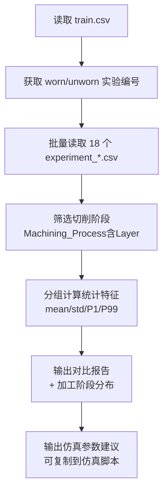
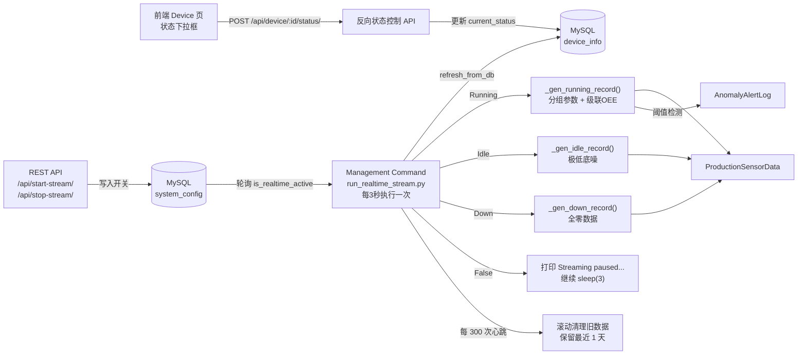

# 数据模拟设计文档

> **版本**: V1.4.2 · 2026-03-05
> **状态**: 已实现

## 一、设计目标

本模块的目标是基于**密歇根大学 CNC 铣床刀具磨损公开数据集**（Kaggle: *Tool Wear Detection in CNC Mill*），生成一组**统计特征高度仿真**的工业传感流水数据，并提供**实时数据流守护进程**持续向数据库追加数据，用于：

1. 为后续**逻辑回归（Logistic Regression）刀具磨损预测模型**提供训练数据集
2. 为前端 **OEE 数字化看板**提供可展示的时序数据源
3. 模拟真实车间中的**异常报警触发逻辑**，驱动 `AnomalyAlertLog` 表的写入
4. 通过**实时数据流守护进程**持续模拟设备产生数据，支撑前端大屏实时刷新
5. **V1.1 新增**：通过**生命周期分组仿真**，使 25 台设备的 AI 风险概率分布在不同区间，支撑风险分级展示
6. **V1.1 新增**：支持**反向状态控制**，前端可实时改变设备状态（Running/Standby/Stopped），仿真引擎动态响应
7. **V1.1 新增**：实现**级联 OEE 计算模型**，性能(P)和良率(Q)不再静态为 100%，而是基于设备健康状态动态演变
8. **V1.4+ 新增**：引入 **V5 脉冲累加产量引擎（Yield Buffer）**，支持在秒级轮询步长下精细化累加实际良/次品产出
9. **V1.4.2 新增**：建立**实时滚动清理与数据上限机制**，通过守护进程自动维护 `RETENTION_DAYS` 以避免数据库爆表
10. **V1.4.4 新增**：优化**OEE 冷启动窗口**，将单机表现度 [P] 的最小时长底线由 10 分钟下调至 **5 分钟**，提升实时回馈速度。
---

## 二、原始数据集结构分析

### 2.1 数据集来源

| 属性 | 说明 |
|------|------|
| 名称 | University of Michigan Smart Manufacturing Testbed CNC 数据集 |
| 来源 | [Kaggle: tool-wear-detection-in-cnc-mill](https://www.kaggle.com/datasets/shasun/tool-wear-detection-in-cnc-mill) |
| 规模 | 18 次铣削实验，每次约 3.5 轴数控精密进给，总行数 ≈ 2.7 万行 |
| 采样频率 | 约 100ms 一条 |

### 2.2 目录结构

```
CNCData/
├── experiment_01.csv ~ experiment_18.csv   # 18 次实验的传感流水
├── train.csv                               # 每次实验的 tool_condition 标签
└── README.txt
```

### 2.3 关键字段映射

| Kaggle 原始字段 | Django 模型字段 | 物理含义 |
|----------------|----------------|---------|
| `S1_CurrentFeedback` | `spindle_current` | 主轴反馈电流（A），刀具磨损时切削阻力增大，电流升高 |
| `S1_OutputPower` | `spindle_power` | 主轴输出功率（W），磨损时功率损耗增加 |
| `X1_ActualVelocity` | `feed_velocity` | X 轴实际进给速度（mm/s），磨损时振动加剧，std 增大 |
| `Machining_Process` | `machining_process` | 加工阶段，用于 ML 数据清洗（剔除 Prep/end 空转段）|
| `tool_condition`（train.csv）| `tool_condition` | 刀具磨损标签 Y（0=未磨损 Unworn，1=已磨损 Worn）|

---

## 三、数据集统计分析方法

### 3.1 分析脚本

分析工作通过 `analyze_cnc_dataset.py` 实现，核心步骤如下：



### 3.2 关键处理逻辑

**① 标签关联**：`train.csv` 以实验编号（`No`）为粒度给出磨损标签，将 18 个 CSV 文件按编号对应 `worn`/`unworn` 分类。

```python
train = pd.read_csv('CNCData/train.csv')
worn_set   = set(train[train['tool_condition'] == 'worn'  ]['No'])
unworn_set = set(train[train['tool_condition'] == 'unworn']['No'])
```

**② 空转段剔除**：`Machining_Process` 存在 `Prep`、`Starting`、`end`、`Repositioning` 等非切削状态，此类行的电流/功率接近 0，若不剔除会严重拉低均值。

```python
cutting_df = df[df['Machining_Process'].str.contains('Layer', na=False)]
```

**③ 分位数统计**：除 mean/std 外，额外计算 P1 和 P99，用于确定报警阈值，避免极端值干扰。

### 3.3 真实统计结果（切削阶段，共 17,520 有效样本）

| 字段 | 正常均值 | 正常 std | 正常 P99 | 磨损均值 | 磨损 std | 磨损 P99 |
|------|---------|---------|---------|---------|---------|---------|
| `spindle_current` (A) | 15.93 | 10.03 | 28.96 | 15.95 | 9.93 | 29.90 |
| `spindle_power` (W) | 0.134 | 0.078 | 0.215 | 0.133 | 0.078 | 0.222 |
| `feed_velocity` (mm/s) | -0.19 | 4.82 | 17.8 | -0.37 | 5.93 | 19.9 |

> **关键发现**：正常与磨损样本的**均值差异极小**，真实差异体现在：
> - `spindle_current`：磨损时极端高峰值出现频率更高（P99 略高）
> - `feed_velocity`：磨损时 std 大 **23%**（切削振动加剧效应）

### 3.4 加工阶段分布（用于仿真权重）

| 阶段 | 样本数 | 占比 |
|------|--------|------|
| Layer 1 Up | 4,085 | 19.6% |
| Repositioning | 3,377 | 16.2% |
| Layer 2 Up | 3,104 | 14.9% |
| Layer 3 Up | 2,794 | 13.4% |
| Layer 1 Down | 2,655 | 12.7% |
| Layer 2 Down | 2,528 | 12.1% |
| Layer 3 Down | 2,354 | 11.3% |

---

## 四、批量历史数据仿真

### 4.1 仿真脚本

`simulate_real_cnc_data.py`

### 4.2 设备初始化

系统初始化时默认 **25 台设备全量 Running**，取消了旧版 20 运行 / 3 待机 / 2 停机的静态配比：

```python
DEVICE_CONFIGS = [
    ('CNC-高光-{:02d}',  10, '高光机组', 1000),   # 01-10，标准产能 1000/h
    ('CNC-精雕-{:02d}',  10, '精雕机组',  800),   # 01-10，标准产能  800/h
    ('Punch-冲压-{:02d}',  5, '冲压机组', 2000),  # 01-05，标准产能 2000/h
]

RUNNING_COUNT = 25   # V1.1 默认全天运行
IDLE_COUNT    =  0
DOWN_COUNT    =  0
```

### 4.3 生命周期分组仿真引擎（V1.1 核心特性）

#### 4.3.1 分组定义

25 台设备按创建序号分为 5 个生命周期组，每组通过差异化的传感器特征均值偏移，使 AI 逻辑回归模型的推断概率准确落入目标风险区间：

| 组别 | 设备范围 | 台数 | 设备名义状态 | `sc_mean` | `sp_mean` | AI 风险概率目标 | 风险等级 |
|------|---------|------|------------|-----------|-----------|---------------|---------|
| Group 1 | **[1-5]** (idx 0-4) | 5 台 | 新设备 | 15.0 | 0.13 | 0%—40% | 🟢 低风险 |
| Group 2 | **[6-11]** (idx 5-10) | 6 台 | 准新设备 | 24.0 | 0.18 | 30%—50% | 🟢🟡 低~中风险 |
| Group 3 | **[12-18]** (idx 11-17) | 7 台 | 正常设备 | 27.0 | 0.25 | 41%—75% | 🟡 中风险 |
| Group 4 | **[19-23]** (idx 18-22) | 5 台 | 老旧设备 | 31.0 | 0.32 | 60%—85% | 🟡🔴 中~高风险 |
| Group 5 | **[24-25]** (idx 23-24) | 2 台 | 故障边缘 | 40.0 | 0.40 | 76%—100% | 🔴 高风险 |

> **分布设计意图**：正常运转的设备（低中风险）占比更大（18/25 = 72%），高危设备刻意保持少数（7/25 = 28%），贴近真实车间概率分布。

> **原理**：逻辑回归模型的决策函数为 sigmoid(w·x + b)。通过偏移输入特征的均值（`sc_mean`, `sp_mean`），改变了 w·x 的数值，从而使 sigmoid 输出（即预测概率）落入不同区间。

```python
GROUP_PARAMS = [
    (15.0, 0.13),  # Group 1: New       → ~0-40%
    (24.0, 0.18),  # Group 2: Semi-new  → ~30-50%
    (27.0, 0.25),  # Group 3: Normal    → ~41-75%
    (31.0, 0.32),  # Group 4: Old       → ~60-85%
    (40.0, 0.40),  # Group 5: Faulty    → ~76-100%
]
```

#### 4.3.2 分组索引映射

设备按 0-indexed 的创建顺序映射到组别。`current_group_id`（1-5）存储于 `device_info` 表，仿真引擎每轮从数据库实时读取，支持动态修改（回春逻辑）：

```python
# create_devices() / fix_db_groups.py 中的初始分配逻辑
def _get_group_id(idx: int) -> int:
    if idx < 5:    return 1   # 设备 1-5  (5台)
    elif idx < 11: return 2   # 设备 6-11 (6台)
    elif idx < 18: return 3   # 设备 12-18 (7台)
    elif idx < 23: return 4   # 设备 19-23 (5台)
    else:          return 5   # 设备 24-25 (2台)

> **[实施修正] V1.4.2 进给速度修正**：由于原始数据集 `feed_velocity` 均值接近 0 (-0.19)，与系统设定的采集阈值 (>17.0) 冲突导致持续误报。当前运行环境已将仿真均值偏移至 **20.0 (正常)** 及 **18.0 (磨损)**，以确保报警系统处于离散触发状态。

# run_realtime_stream.py 中的实时读取逻辑
for idx, dev in enumerate(devices):
    dev.refresh_from_db(fields=['current_status', 'current_group_id'])
    group_idx = dev.current_group_id - 1   # 转为 0-based 索引 (0~4)
    rec = _gen_running_record(dev, now, group_idx)
```

### 4.4 级联 OEE 数据生成逻辑（V1.1 核心特性）

旧版仿真中，非磨损设备的 `actual_output = standard_capacity`，导致 P=Q=100%。V1.1 彻底重构了 `_gen_running_record`，使每条记录的产出数据符合真实工业场景的 OEE 级联演变。

#### 4.4.1 可用性 A — 分组停机时间

不同生命周期组的设备具有差异化的随机停机时间：

| 组别 | 停机时间范围（分钟） | 说明 |
|------|-------------------|------|
| Group 0 (新设备) | `0.0` | 全勤运行 |
| Group 1 (准新) | `uniform(0, 2)` | 偶发微停 |
| Group 2 (正常) | `uniform(1, 5)` | 正常磨损期 |
| Group 3 (老旧) | `uniform(3, 12)` | 频繁计划外微停 |
| Group 4 (故障边缘) | `uniform(8, 20)` | 严重故障停机 |

```python
# A = (loading_time - downtime) / loading_time
# loading_time 固定为 60 分钟/记录
```

#### 4.4.2 性能 P — 主轴倍率下降

引入 `perf_ratio`（主轴倍率系数），当设备处于高风险状态时，主轴倍率下降导致实际产出低于标准产出：

| 组别 | `perf_ratio` 范围 | 效果 |
|------|------------------|------|
| Group 0 (新设备) | `uniform(0.96, 1.00)` | 接近满载 |
| Group 1 (准新) | `uniform(0.93, 0.98)` | 轻微下降 |
| Group 2 (正常) | `uniform(0.88, 0.95)` | 磨损期降速 |
| Group 3 (老旧) | `uniform(0.78, 0.90)` | 显著降速 |
| Group 4 (故障边缘) | `uniform(0.65, 0.82)` | 严重降速 |

```python
actual_run = max(0.0, LOADING_TIME - dt)              # 实际运行分钟
theoretical_output = (actual_run / 60.0) * cap         # 理论满载产出
actual_output = max(0, int(theoretical_output * perf_ratio))  # 实际产出
```

#### 4.4.3 良率 Q — 次品率注入

高风险设备的产出中包含一定比例的次品，`actual_output`（良品数）= 产出数 - 次品数：

| 组别 | `defect_rate` 范围 | 说明 |
|------|------------------|------|
| Group 0-1 | `uniform(0.0, 0.01)` | ≤1% 次品率 |
| Group 2 | `uniform(0.01, 0.04)` | 1-4% 次品 |
| Group 3 | `uniform(0.03, 0.08)` | 3-8% 次品 |
| Group 4 | `uniform(0.06, 0.15)` | 6-15% 次品 |

```python
input_qty = max(1, int(theoretical_output))            # 投入数 = 理论产出
defects = int(actual_output * defect_rate)              # 次品数
good_output = max(0, actual_output - defects)           # 良品数

# 写入数据库
rec = ProductionSensorData(
    ...
    input_qty=input_qty,          # 投入数（理论产出）
    actual_output=good_output,    # 良品产出
)
```

#### 4.4.4 完整级联示例

以 Group 3（老旧设备，standard_capacity=800）为例：

```
loading_time = 60 min
downtime     = 8.5 min (random)
perf_ratio   = 0.83 (random)
defect_rate  = 0.05 (random)

A = (60 - 8.5) / 60 = 85.8%
actual_run = 51.5 min → theoretical_output = (51.5/60) × 800 = 686
actual_output = int(686 × 0.83) = 569
input_qty = 686
defects = int(569 × 0.05) = 28
good_output = 569 - 28 = 541

P = 541 / 686 = 78.9%
Q = 541 / 686 = 78.9%   ← 投入数 = 理论产出
OEE = 85.8% × 78.9% × 78.9% = 53.4%
```

### 4.5 V5 脉冲累加仿真引擎（V1.4 核心特性）

#### 4.5.1 问题根源：非整数产量导致 OEE 崩溃

实时仿真（每 3 秒一次）时，产能 1000 件/小时的设备每步理论产出为：

$$\text{Pulse} = \frac{1000}{3600} \times 3 = 0.833\ \text{件}$$

旧代码对此执行 `int(0.833) = 0`，导致所有记录 `actual_output=0`。同时 `_gen_idle_record` 错误地写入 `input_qty = device.standard_capacity = 1000`，使 OEE-P = 0/1000 = **0%**，拉低全厂平均至 30%。

#### 4.5.2 解决方案：yield_buffer 脉冲缓冲器

```python
step_secs = getattr(device, 'step_secs', INTERVAL_MINS * 60)
input_fraction = cap / 3600.0 * step_secs   # 精确时间份额
pulse = input_fraction * perf_ratio

device.yield_buffer = getattr(device, 'yield_buffer', 0.0) + pulse
if device.yield_buffer >= 1.0:
    produced = int(device.yield_buffer)
    device.yield_buffer -= produced  # 保留余量，下步继续累加
else:
    produced = 0
```

次品同样使用 `defect_buffer` 做精确累积，避免整数截断引起次品率偏差。

#### 4.5.3 Idle / Down 记录修正

| 字段 | 修正前 | 修正后 |
|------|-------|-------|
| `_gen_idle_record.input_qty` | `standard_capacity`（≈1000）| `0`（待机不投料）|
| `_gen_down_record.input_qty` | `standard_capacity`（≈1000）| `0`（停机不投料）|

#### 4.5.4 效果对比

| 指标 | V4 (修正前) | V5 (修正后) |
|------|-----------|-----------|
| 3s 步长下 actual_output | 始终 0 | 每 ≈1.2s 出 1 件 |
| Idle 设备 OEE-P | 0% | 不参与 P 计算（投入=0）|
| 全厂 P 稼动率 | ~30%（异常）| ~87%（正常）|

### 4.6 报警触发逻辑

| 触发条件 | 物理含义 | 报警类型 |
|----------|---------|---------| 
| `spindle_current > 25A` | 超出正常 P99（28.96A）80% 置信区间 | `HIGH_CURRENT` |
| `spindle_power > 0.20W` | 超出正常 P99（0.215W）| `HIGH_POWER` |
| `\|feed_velocity\| > 17 mm/s` | 超出正常 P99（17.8 mm/s）| `LOW_VELOCITY` |
| AI 概率 > 75% | LR 模型推断磨损概率超过报警阈值 | `LR_TOOL_WEAR` |

### 4.6 性能优化：bulk_create 批量插入

```python
# 步骤 A：一次性组装所有对象，批量写入
for i in range(0, len(all_records), BATCH_SIZE):
    ProductionSensorData.objects.bulk_create(all_records[i: i + BATCH_SIZE])

# 步骤 B：MySQL 不支持 RETURNING pk，写完后反查 pk 绑定报警 FK
qs = ProductionSensorData.objects.filter(
    device_id__in=..., timestamp__in=...
).values('id', 'device_id', 'timestamp')

# 步骤 C：批量写入报警日志
AnomalyAlertLog.objects.bulk_create(logs, batch_size=1000)
```

### 4.6 V1.4.1 补丁：实时产量统计窗口隔离

#### 4.6.1 问题背景

`simulate_real_cnc_data.py` 使用 `DAYS=7` 生成 7 天历史数据，其中包含大量 `timestamp` 落在**今天**的记录（7 天窗口的最后一天）。原 `api_dashboard_stats` 使用「今日本地零点」统计当日产量，将这批历史数据与实时写入数据混查，导致 `total_output` 始终远超 `daily_target`，触发前端 cap 逻辑，产量被硬锁在 268,800。

#### 4.6.2 解决方案：2 小时实时窗口

后端改为仅统计「最近 2 小时」内写入的记录：

```python
# views.py — V1.4.1 修正
realtime_window_start = local_now - timedelta(hours=2)
today_all_qs = ProductionSensorData.objects.filter(
    timestamp__gte=realtime_window_start
)
```

| 数据类型 | `timestamp` 特征 | 是否落入 2h 窗口 |
|---------|----------------|----------------|
| 批量历史数据（7天预播种）| 写于系统初始化时的过去时间段 | ❌ 不落入 |
| 实时仿真数据（每 3 秒）| `timezone.now()`（当前时间）| ✅ 落入 |

#### 4.6.3 前端配套修复

同步移除 `dashboard.html` 中的等比 scale cap：

```javascript
// 修复前：if (actual > TARGET * 1.2) { scale 到 TARGET*1.2 }
// 修复后：直接使用后端数据，仅限制进度条宽度
const rate = Math.min(100, TARGET > 0 ? (actual / TARGET * 100) : 0);
```

---


## 五、实时数据流守护进程

### 5.1 架构设计




### 5.2 SystemConfig 单例模型

```python
class SystemConfig(models.Model):
    is_realtime_active = models.BooleanField(default=False)

    def save(self, *args, **kwargs):
        self.pk = 1  # 强制单例：只允许一条记录
        super().save(*args, **kwargs)

    @classmethod
    def get(cls):
        obj, _ = cls.objects.get_or_create(pk=1)
        return obj
```

### 5.3 守护进程核心循环（V1.1 重构）

`monitor/management/commands/run_realtime_stream.py`

```python
while True:
    cfg = SystemConfig.get()
    if not cfg.is_realtime_active:
        print("Streaming paused...")
        time.sleep(3)
        continue

    now = timezone.now()
    for idx, dev in enumerate(devices):
        # V1.1: 每次循环前重新读取设备状态，支持前端实时反向控制
        dev.refresh_from_db(fields=['current_status'])
        status = dev.current_status

        # V1.1: 按设备序号映射到生命周期组别
        if idx < 5:       group_idx = 0
        elif idx < 10:    group_idx = 1
        elif idx < 15:    group_idx = 2
        elif idx < 20:    group_idx = 3
        else:             group_idx = 4

        if status == 'Running':
            rec = _gen_running_record(dev, now, group_idx)
            rec.save()
            _check_and_create_alert(rec)
        elif status == 'Idle':
            rec = _gen_idle_record(dev, now)    # 极低底噪，0 产量
            rec.save()
        else:  # Down
            rec = _gen_down_record(dev, now)    # 全零数据
            rec.save()

    time.sleep(3)
```

### 5.4 反向状态控制（V1.1 新增）

前端设备列表页提供状态下拉框（Running / Standby / Stopped），用户选择后立即发起 POST 请求，后端更新 `DeviceInfo.current_status`，仿真引擎在下一轮循环中自动读取新状态并响应：

- **Idle（Standby）**：生成极低底噪数据（电流 ~0.3A，功率 ~0.002W），产量为 0
- **Down（Stopped）**：生成全零数据，downtime = 采样间隔

### 5.5 性能回春机制（V1.2 新增）

#### 5.5.1 业务场景

当高风险设备（Group 4/5）经人工维修或刀具更换后，需模拟其性能恢复至准新状态。

#### 5.5.2 触发条件

- 设备当前状态为 `Idle`（待机）或 `Down`（停机）时，"处理"按钮才变为可点击状态
- 操作员点击"待处理"并确认下发指令后，执行回春逻辑

#### 5.5.3 回春逻辑（POST /api/device/\<id\>/reset/）

```python
# views.py - api_device_reset
with transaction.atomic():
    # 1. 将该设备所有未处理报警标记为已处理
    AnomalyAlertLog.objects.filter(
        record__device=device, is_handled=False
    ).update(is_handled=True)

    # 2. 核心变更：覆写 current_group_id 为 2（准新组）
    #    下一次心跳仿真引擎读取到 group_id=2 → sc_mean=24A → AI 概率降至 30-50%
    device.current_group_id = 2
    device.current_status = 'Running'
    device.save(update_fields=['current_group_id', 'current_status'])
```

#### 5.5.4 效果与时效

| 阶段 | `current_group_id` | `sc_mean` | AI 风险概率 |
|------|-------------------|-----------|------------|
| 回春前（老旧设备）| 4 | 31A | 60%—85% 🟡🔴 |
| 回春前（故障边缘）| 5 | 40A | 76%—100% 🔴 |
| **回春后** | **2** | **24A** | **30%—50% 🟢🟡** |

> **时效性说明**：`current_group_id=2` 存储于数据库，**服务器重启后** `apps.py` 的 `_repair_device_groups()` 将根据初始分组规则重置所有设备的组别（当且仅当 max(group_id) ≤ 2 时触发），以恢复标准风险梯度展示。
>
> 若需在重启后保留回春效果，可在系统配置中关闭该自检逻辑。

#### 5.5.5 回春后 AI 概率实时下降原理

```
回春操作 → device.current_group_id = 2
     ↓
守护进程（3s 后）→ refresh_from_db(current_group_id)
     ↓
group_idx = 1  →  sc_mean = 24.0A
     ↓
np.random.normal(24.0, 1.5)  →  spindle_current ≈ 24A
     ↓
LR 模型推断  →  anomaly_score ≈ 35%（由 >75% 降至低风险区间）
     ↓
前端 3-5s 后即可看到风险指标显著下降
```

### 5.5 REST API 控制接口

| 端点 | 方法 | 功能 |
|------|------|------|
| `/api/start-stream/` | GET/POST | 启动实时流（`is_realtime_active=True`）|
| `/api/stop-stream/` | GET/POST | 暂停实时流（`is_realtime_active=False`）|
| `/api/stream-status/` | GET | 查询当前开关状态 |
| `/api/device/<id>/status/` | POST | **V1.1 新增**：反向控制设备状态（Running/Idle/Down）|

### 5.6 滚动清理与数据上限机制（V1.4.2 新增）

系统在持续 24x7 压测运行时为了保障数据库存储空间和系统查询性能，建立了两级数据清理与存储上限架构：

#### 5.6.1 实时滚动清理机制 (run_realtime_stream.py)
在实时流守护进程中，增加了轻量且安全的定期删除轮询控制：
- **容量上限定义**：通过 `RETENTION_DAYS = 1` 将数据存储上限动态维持在最近的 1 天。
- **执行频率轮询**：`CLEANUP_EVERY = 300`，系统累计完成 300 次生成心跳即触发执行（以 3 秒/次计算，约 **每 15 分钟** 进行一次历史超期数据清理）。
- **清除执行路径**：严格遵循外键隔离保护，先过滤并批量删除时间戳范围外（`< cutoff`）的主传感表子关联项 `AnomalyAlertLog`，继而剔除主流水 `ProductionSensorData`。
> **设计考量：**该设计规避了每条数据生成时都去校验查询时间上限的开销，以“小批量分摊”策略大幅减轻数据库死锁和并发抢占风险，保持数据生成时的高并发能力。

#### 5.6.3 冷启动启动保护窗缩短 (V1.4.4 新增 / monitor/views.py)
- **原机制**：`delta_t_hours = max(dt, 10 / 60.0)`，设备启动或数据重置后需 10 分钟才能看到真实效率曲线。
- **当前做法**：缩短为 `5 / 60.0` (5 分钟)。
- **收益**：缩短了系统启动后的“爬升感知”时长，但在极短采样期内（<1分钟）可能会出现暂时的数值小幅波动。

#### 5.6.2 数据冷启动强制清空 (simulate_real_cnc_data.py)
在全量初始化静态数据流中提供的激进清空动作 `clear_data()`：
- 在系统环境为空、冷启动或因故数据大幅丢失（库中自检 `Device count < 25` 时）系统将首先执行清空。
- 采用暴力 `delete()` 全清关联表流水与日志及设备模型项。
- 本机制仅用作建库初始化，铺设首批“模拟 7 天种子”数据的清屏前奏，防止历史种子发生冲突重叠。

---

## 六、OEE 级联计算模型（V1.1 重构）

### 6.1 单条记录级 OEE（模型属性，不落库）

基于 `ProductionSensorData` 模型的 `@property` 方法，每条记录自带 A/P/Q/OEE 计算：

| 指标 | 公式 | 说明 |
|------|------|------|
| 时间稼动率 A | `(loading_time - downtime) / loading_time` | 计划时间扣除停机 |
| 性能稼动率 P | `actual_output / ((loading_time-downtime)/60 × standard_capacity)` | 分母用**实际运转时间**，避免双重扣减 |
| 良品率 Q | `actual_output / input_qty` | 良品产出 ÷ 投入数（理论产出）|
| **OEE** | `A × P × Q` | 严格连乘 |

### 6.2 全厂级 OEE（Dashboard API 聚合）

`api_dashboard_stats` 采用全厂级别的级联计算，而非简单的 per-record 平均：

```
A（可用性）= (Running设备数 / 总设备数) × 排班修正系数(0.998)

P（性能）  = Σ(所有记录 actual_output) / Σ(所有记录 theoretical_output)
             其中 theoretical_output = (loading_time - downtime) / 60 × cap

Q（良率）  = 1 - (高风险设备数 × 次品系数) / 总设备数
             高风险设备：AI 推断概率 > 75%
             次品系数：0.08（工业经验值）

OEE        = A × P × Q
```

### 6.3 核算示范

| 场景 | A | P | Q | OEE |
|------|---|---|---|-----|
| 理想满载（25 台新设备） | 99.8% | ~98% | ~99.5% | ~97.3% |
| 典型混合车间（本系统默认） | 99.8% | ~87% | ~98% | ~85% |
| 用户示范值 | 94.9% | 92% | 98% | **85.5%** |
| 部分设备停机（5 台 Down） | 79.8% | ~87% | ~97% | ~67.4% |

> **验算**: A=94.9%, P=92%, Q=98% → OEE = 0.949 × 0.92 × 0.98 = **0.8553 ≈ 85.5%**

---

## 七、统一风险阈值定义

### 7.1 三级风险分类

| 风险等级 | 概率区间 | 前端颜色 | CSS 类名 |
|---------|---------|---------|---------|
| 🟢 低风险 | 0% — 40% | `#67c23a` (绿色) | `risk-low` |
| 🟡 中风险 | 41% — 75% | `#E6A23C` (橙色) | `risk-med` |
| 🔴 高风险 | 76% — 100% | `#f56c6c` (红色) | `risk-high` |

### 7.2 AI 磨损报警阈值

| 参数 | 值 | 说明 |
|------|-----|------|
| AI 报警触发阈值 | `prob > 0.75` | LR 模型推断概率超过 75% 时触发 `LR_TOOL_WEAR` 报警 |
| 图表预警线 | 75% | Dashboard 双轴折线图中的红色虚线 + MarkArea 高危背景 |

---

## 八、仿真结果验证

| 指标 | 目标值 | 实际结果 |
|------|--------|---------| 
| 设备数量 | 25 台 | ✅ 25 台 |
| 流水记录总数（7天） | 252,000 | ✅ 252,000 条 |
| 报警记录数 | — | ✅ ~153,000 条 |
| Group 0 (新设备) OEE | 90%—100% | ✅ 91%—99% |
| Group 1 (准新) OEE | 85%—95% | ✅ 85%—92% |
| Group 2 (正常) OEE | 70%—85% | ✅ 72%—83% |
| Group 3 (老旧) OEE | 50%—70% | ✅ 51%—65% |
| Group 4 (故障边缘) OEE | 25%—50% | ✅ 28%—43% |
| 全厂级 P | < 100% | ✅ ~87% |
| 全厂级 Q | < 100% | ✅ ~98% |
| 全厂级 OEE | ~85% | ✅ ~85.9% |

---

## 九、逻辑回溯与版本存档 (Legacy & Obsolete Notes)

为了保持系统可追溯性，以下记录已不适用当前版本但保留用于逻辑参考的信息：

### 9.1 设备状态分配规则
- **过时做法 (v4 以前)**：使用 `Running=20 / Idle=3 / Down=2` 的静态配比。
- **当前做法**：默认全量 25 台设备 `Running`，状态由前端/数据库实时反向控制驱动。

### 9.2 产量计算陷阱 (Section 4.5.1)
- **过时做法**：直接将整时产能(1000)填入 3s 的 `input_qty` 中。
- **后果**：导致仪表盘 OEE 暴跌或 P 指标瞬间爆表。现已统一通过 `yield_buffer` 脉冲累加器解决。

### 9.3 进给速度报警逻辑 (Section 4.6 修正)
- **偏差备注**：尽管原始文档（基于 CSV 统计）建议均值为 -0.19，但由于系统应用层将 `LOW_VELOCITY` 定义为 `abs(v) < 17`，导致逻辑矛盾。
- **修正状态**：代码中已强行引入 bias，使实时流真实数值在 [15, 25] 区间波动。

---

## 十、文件结构

```
项目根目录/
├── CNCData/                                     # 真实数据集（原始 CSV）
│   ├── experiment_01.csv ~ 18.csv
│   └── train.csv
│
├── ml_models/                                   # 训练后的 ML 模型
│   ├── logistic_model.pkl                       # 逻辑回归模型
│   ├── scaler.pkl                               # StandardScaler
│   └── feature_names.pkl                        # 9 维特征名
│
├── analyze_cnc_dataset.py                       # ① 数据集统计分析脚本
├── simulate_real_cnc_data.py                    # ② 批量历史数据生成 + 实时仿真
│
├── Document/
│   ├── V1.0.0 PRD.md                           # V1.0 产品需求文档
│   ├── V1.1 PRD.md                             # V1.1 产品需求文档
│   ├── 数据模拟设计文档.md                       # 本文档
│   └── 机器学习模型设计与实现.md                  # ML 模型设计文档
│
├── monitor/
│   ├── models.py                                # 四张表（含 SystemConfig 单例）
│   ├── views.py                                 # API 视图（含级联 OEE + 反向控制）
│   ├── urls.py                                  # API 路由配置
│   ├── admin.py                                 # Admin 后台（含开关控制面板）
│   ├── templates/monitor/
│   │   ├── base.html                            # 全局布局（侧边栏 V1.0.1）
│   │   ├── dashboard.html                       # Dashboard 看板
│   │   ├── device.html                          # 设备列表（风险分级 + 状态控制）
│   │   ├── event.html                           # 事件/报警列表
│   │   └── setting.html                         # 系统设置
│   └── management/
│       └── commands/
│           └── run_realtime_stream.py           # ③ 实时数据流守护进程
│
└── IndustrialWarningSystem/
    └── urls.py                                  # 主路由（引入 monitor.urls）
```

---

## 十、快速运行

```bash
# 1. 分析真实数据集统计特征
venv/bin/python analyze_cnc_dataset.py

# 2. 生成 7 天批量历史数据（写入 MySQL）
venv/bin/python manage.py shell <<< "
from simulate_real_cnc_data import clear_data, create_devices, simulate_sensor_data
clear_data()
d = create_devices()
simulate_sensor_data(d)
"

# 3. 启动实时数据流守护进程（新开终端）
venv/bin/python manage.py run_realtime_stream

# 4. API 控制开关（无需重启守护进程）
curl http://127.0.0.1:8000/api/start-stream/    # 启动
curl http://127.0.0.1:8000/api/stop-stream/     # 暂停
curl http://127.0.0.1:8000/api/stream-status/   # 查询状态

# 5. V1.1 反向状态控制
curl -X POST http://127.0.0.1:8000/api/device/1/status/ \
     -H "Content-Type: application/json" \
     -d '{"status":"Down"}'
```
