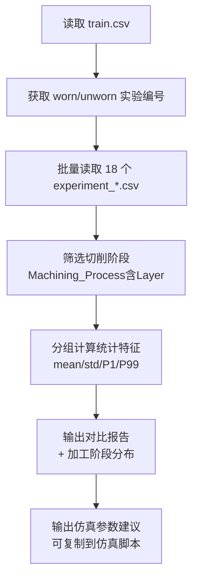
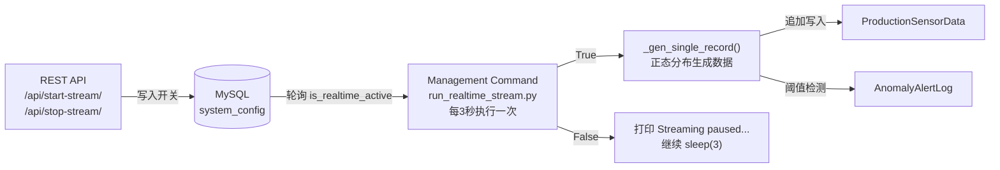

# 数据模拟设计文档

## 一、设计目标

本模块的目标是基于**密歇根大学 CNC 铣床刀具磨损公开数据集**（Kaggle: *Tool Wear Detection in CNC Mill*），生成一组**统计特征高度仿真**的工业传感流水数据，并提供**实时数据流守护进程**持续向数据库追加数据，用于：

1. 为后续**逻辑回归（Logistic Regression）刀具磨损预测模型**提供训练数据集
2. 为前端 **OEE 数字化看板**提供可展示的时序数据源
3. 模拟真实车间中的**异常报警触发逻辑**，驱动 `AnomalyAlertLog` 表的写入
4. 通过**实时数据流守护进程**持续模拟设备产生数据，支撑前端大屏实时刷新

---

## 二、原始数据集结构分析

### 2.1 数据集来源

| 属性 | 说明 |
|------|------|
| 名称 | University of Michigan Smart Manufacturing Testbed CNC 数据集 |
| 来源 | [Kaggle: tool-wear-detection-in-cnc-mill](https://www.kaggle.com/datasets/shasun/tool-wear-detection-in-cnc-mill) |
| 规模 | 18 次铣削实验，每次约 3.5 轴数控精密进给，总行数 ≈ 2.7 万行 |
| 采样频率 | 约 100ms 一条 |

### 2.2 目录结构

```
CNCData/
├── experiment_01.csv ~ experiment_18.csv   # 18 次实验的传感流水
├── train.csv                               # 每次实验的 tool_condition 标签
└── README.txt
```

### 2.3 关键字段映射

| Kaggle 原始字段 | Django 模型字段 | 物理含义 |
|----------------|----------------|---------|
| `S1_CurrentFeedback` | `spindle_current` | 主轴反馈电流（A），刀具磨损时切削阻力增大，电流升高 |
| `S1_OutputPower` | `spindle_power` | 主轴输出功率（W），磨损时功率损耗增加 |
| `X1_ActualVelocity` | `feed_velocity` | X 轴实际进给速度（mm/s），磨损时振动加剧，std 增大 |
| `Machining_Process` | `machining_process` | 加工阶段，用于 ML 数据清洗（剔除 Prep/end 空转段）|
| `tool_condition`（train.csv）| `tool_condition` | 刀具磨损标签 Y（0=未磨损 Unworn，1=已磨损 Worn）|

---

## 三、数据集统计分析方法

### 3.1 分析脚本

分析工作通过 [`analyze_cnc_dataset.py`](file:///Users/chanchihkai/Documents/毕业设计：基于机器学习的工业生产数据异常预警系统的设计与实现/analyze_cnc_dataset.py) 实现，核心步骤如下：



### 3.2 关键处理逻辑

**① 标签关联**：`train.csv` 以实验编号（`No`）为粒度给出磨损标签，将 18 个 CSV 文件按编号对应 `worn`/`unworn` 分类。

```python
train = pd.read_csv('CNCData/train.csv')
worn_set   = set(train[train['tool_condition'] == 'worn'  ]['No'])
unworn_set = set(train[train['tool_condition'] == 'unworn']['No'])
```

**② 空转段剔除**：`Machining_Process` 存在 `Prep`、`Starting`、`end`、`Repositioning` 等非切削状态，此类行的电流/功率接近 0，若不剔除会严重拉低均值。

```python
cutting_df = df[df['Machining_Process'].str.contains('Layer', na=False)]
```

**③ 分位数统计**：除 mean/std 外，额外计算 P1 和 P99，用于确定报警阈值，避免极端值干扰。

### 3.3 真实统计结果（切削阶段，共 17,520 有效样本）

| 字段 | 正常均值 | 正常 std | 正常 P99 | 磨损均值 | 磨损 std | 磨损 P99 |
|------|---------|---------|---------|---------|---------|---------|
| `spindle_current` (A) | 15.93 | 10.03 | 28.96 | 15.95 | 9.93 | 29.90 |
| `spindle_power` (W) | 0.134 | 0.078 | 0.215 | 0.133 | 0.078 | 0.222 |
| `feed_velocity` (mm/s) | -0.19 | 4.82 | 17.8 | -0.37 | 5.93 | 19.9 |

> **关键发现**：正常与磨损样本的**均值差异极小**，真实差异体现在：
> - `spindle_current`：磨损时极端高峰值出现频率更高（P99 略高）
> - `feed_velocity`：磨损时 std 大 **23%**（切削振动加剧效应）

### 3.4 加工阶段分布（用于仿真权重）

| 阶段 | 样本数 | 占比 |
|------|--------|------|
| Layer 1 Up | 4,085 | 19.6% |
| Repositioning | 3,377 | 16.2% |
| Layer 2 Up | 3,104 | 14.9% |
| Layer 3 Up | 2,794 | 13.4% |
| Layer 1 Down | 2,655 | 12.7% |
| Layer 2 Down | 2,528 | 12.1% |
| Layer 3 Down | 2,354 | 11.3% |

---

## 四、批量历史数据仿真

### 4.1 仿真脚本

[`simulate_real_cnc_data.py`](file:///Users/chanchihkai/Documents/毕业设计：基于机器学习的工业生产数据异常预警系统的设计与实现/simulate_real_cnc_data.py)

### 4.2 设备初始化

```python
DEVICE_CONFIGS = [
    ('CNC-高光-{:02d}',  4, '高光机组', 1000),  # 4 台，标准产能 1000/h
    ('CNC-精雕-{:02d}',  4, '精雕机组',  800),  # 4 台，标准产能  800/h
    ('Punch-冲压-{:02d}',2, '冲压机组', 2000),  # 2 台，标准产能 2000/h
]
```

### 4.3 核心生成逻辑

数据生成采用**正态分布（`numpy.random.normal`）**，参数来自真实统计结果。

为解决"均值差异不显著"问题，在磨损工况下叠加**业务偏移量**以增强分类边界：

```python
# 磨损工况（tool_condition = True）
spindle_current = np.random.normal(
    mean = 15.95 + 2.0,   # 业务偏移 +2A（刀具磨损导致切削阻力增大）
    std  = 9.93
)
spindle_power = np.random.normal(
    mean = 0.133 + 0.020, # 业务偏移 +15%（磨损功率损耗增加）
    std  = 0.078
)
feed_velocity = np.random.normal(
    mean = -0.37,
    std  = 5.93           # std 自然大 23%，无需额外偏移
)
```

加工阶段按真实 CSV 分布权重随机采样：

```python
machining_proc = np.random.choice(STAGE_LABELS, p=STAGE_PROBS)
```

### 4.4 报警触发逻辑

| 触发条件 | 物理含义 | 报警类型 |
|----------|---------|---------|
| `spindle_current > 25A` | 超出正常 P99（28.96A）80% 置信区间 | `HIGH_CURRENT` |
| `spindle_power > 0.20W` | 超出正常 P99（0.215W）| `HIGH_POWER` |
| `\|feed_velocity\| > 17 mm/s` | 超出正常 P99（17.8 mm/s）| `LOW_VELOCITY` |

### 4.5 性能优化：bulk_create 批量插入

```python
# 步骤 A：一次性组装所有对象，批量写入
for i in range(0, len(all_records), BATCH_SIZE):
    ProductionSensorData.objects.bulk_create(all_records[i: i + BATCH_SIZE])

# 步骤 B：MySQL 不支持 RETURNING pk，写完后反查 pk 绑定报警 FK
qs = ProductionSensorData.objects.filter(
    device_id__in=..., timestamp__in=...
).values('id', 'device_id', 'timestamp')

# 步骤 C：批量写入报警日志
AnomalyAlertLog.objects.bulk_create(logs, batch_size=1000)
```

---

## 五、实时数据流守护进程

### 5.1 架构设计



### 5.2 SystemConfig 单例模型

```python
class SystemConfig(models.Model):
    is_realtime_active = models.BooleanField(default=False)
    
    def save(self, *args, **kwargs):
        self.pk = 1  # 强制单例：只允许一条记录
        super().save(*args, **kwargs)
    
    @classmethod
    def get(cls):
        obj, _ = cls.objects.get_or_create(pk=1)
        return obj
```

### 5.3 守护进程核心循环

[`monitor/management/commands/run_realtime_stream.py`](file:///Users/chanchihkai/Documents/毕业设计：基于机器学习的工业生产数据异常预警系统的设计与实现/monitor/management/commands/run_realtime_stream.py)

```python
while True:
    cfg = SystemConfig.get()
    
    if not cfg.is_realtime_active:
        print("Streaming paused...")
        time.sleep(3)
        continue
    
    # 激活状态：为每台设备生成并追加一条数据
    now = timezone.now()
    for dev in DeviceInfo.objects.all():
        is_worn = random.random() < 0.15      # 15% 异常概率
        rec = _gen_single_record(dev, now, is_worn)
        rec.save()                             # 仅追加，不删除历史
        _check_and_create_alert(rec)           # 阈值检测联动报警
    
    time.sleep(3)
```

### 5.4 REST API 控制接口

| 端点 | 方法 | 功能 |
|------|------|------|
| `/api/start-stream/` | GET/POST | 启动实时流（`is_realtime_active=True`）|
| `/api/stop-stream/` | GET/POST | 暂停实时流（`is_realtime_active=False`）|
| `/api/stream-status/` | GET | 查询当前开关状态 |

---

## 六、OEE 计算公式（SEMI E10 标准）

| 指标 | 公式 | 说明 |
|------|------|------|
| 时间稼动率 | `(loading_time - downtime) / loading_time` | 计划时间扣除停机 |
| 性能稼动率 | `actual_output / ((loading_time-downtime)/60 × standard_capacity)` | 分母用**实际运转时间**，避免双重扣减 |
| 良品率 | `actual_output / input_qty` | 实际产出 ÷ 投料总数 |
| **OEE** | `时间稼动率 × 性能稼动率 × 良品率` | |

---

## 七、仿真结果验证

| 指标 | 目标值 | 实际结果 |
|------|--------|---------|
| 设备数量 | 10 台 | ✅ 10 台 |
| 流水记录总数 | 100,800 | ✅ 100,800 条 |
| 磨损比例 | 15% | ✅ 15.1% |
| 报警记录数 | — | ✅ 36,149 条 |
| 正常工况 OEE | ~100% | ✅ 100.0% |
| 磨损工况 OEE | 50~85% | ✅ 52.9%~79.9% |

---

## 八、文件结构

```
项目根目录/
├── CNCData/                                     # 真实数据集（原始 CSV）
│   ├── experiment_01.csv ~ 18.csv
│   └── train.csv
│
├── analyze_cnc_dataset.py                       # ① 数据集统计分析脚本
├── simulate_real_cnc_data.py                    # ② 批量历史数据生成脚本
│
├── monitor/
│   ├── models.py                                # 四张表（含 SystemConfig 单例）
│   ├── views.py                                 # 实时流 API（start/stop/status）
│   ├── urls.py                                  # API 路由配置
│   ├── admin.py                                 # Admin 后台（含开关控制面板）
│   └── management/
│       └── commands/
│           └── run_realtime_stream.py           # ③ 实时数据流守护进程
│
└── IndustrialWarningSystem/
    └── urls.py                                  # 主路由（引入 monitor.urls）
```

---

## 九、快速运行

```bash
# 1. 分析真实数据集统计特征
venv/bin/python analyze_cnc_dataset.py

# 2. 生成 7 天批量历史数据（写入 MySQL）
venv/bin/python simulate_real_cnc_data.py

# 3. 启动实时数据流守护进程（新开终端）
venv/bin/python manage.py run_realtime_stream

# 4. API 控制开关（无需重启守护进程）
curl http://127.0.0.1:8000/api/start-stream/    # 启动
curl http://127.0.0.1:8000/api/stop-stream/     # 暂停
curl http://127.0.0.1:8000/api/stream-status/   # 查询状态
```
