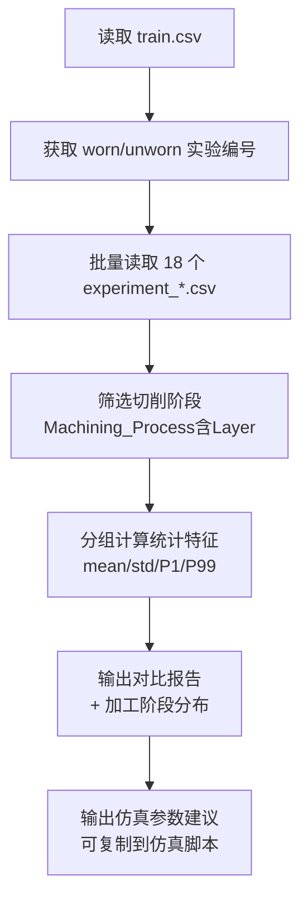
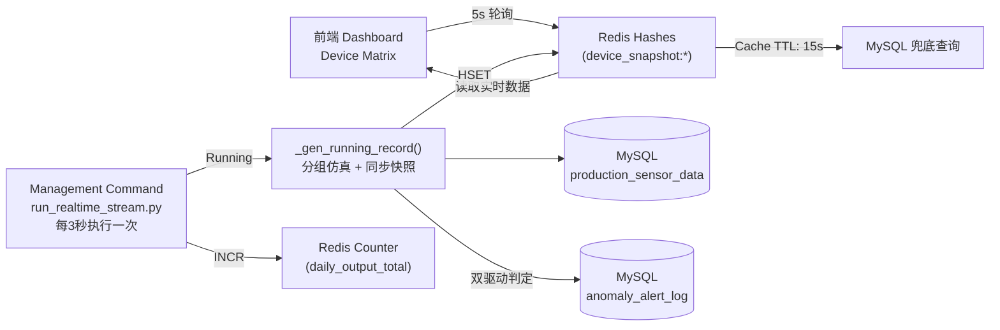

# 数据模拟设计文档

> **版本**: V3.4.5 · 2026-03-28
> **状态**: 已实现 (全频谱解耦仿真 + Redis 同步版)

## 一、设计目标

本模块的目标是基于**密歇根大学 CNC 铣床刀具磨损公开数据集**，生成一组统计特征高度仿真的工业传感数据，并维护一个**实时数据流守护进程**，用于：

1. 为后续 **AI 刀具磨损预测模型**提供训练及推理源数据
2. 为前端 **OEE 数字化看板**提供高频刷新的时序数据
3. 模拟异常触发逻辑，驱动 `AnomalyAlertLog` 的实时写入
4. **V1.1 历史演进**：引入生命周期分组仿真，模拟设备从新机到故障的风险演化
5. **V1.1 历史演进**：支持反向状态控制，前端可实时切换设备运行状态
6. **V1.4+ 历史演进**：引入 **V5 脉冲产量引擎**，解决秒级采样下的非整数产出累加问题
7. **V3.3.0 重要更新**：**Redis-Hybrid 架构**。引入 Redis Hashes 存储设备瞬时快照，绕过 MySQL 轮询瓶颈，支撑 Dashboard 3s 级刷新。
---


## 二、原始数据集结构分析

### 2.1 数据集来源

| 属性 | 说明 |
|------|------|
| 名称 | University of Michigan Smart Manufacturing Testbed CNC 数据集 |
| 来源 | [Kaggle: tool-wear-detection-in-cnc-mill](https://www.kaggle.com/datasets/shasun/tool-wear-detection-in-cnc-mill) |
| 规模 | 18 次铣削实验，每次约 3.5 轴数控精密进给，总行数 ≈ 2.7 万行 |
| 采样频率 | 约 100ms 一条 |

### 2.2 目录结构

```
CNCData/
├── experiment_01.csv ~ experiment_18.csv   # 18 次实验的传感流水
├── train.csv                               # 每次实验的 tool_condition 标签
└── README.txt
```

### 2.3 关键字段映射

| Kaggle 原始字段 | Django 模型字段 | 物理含义 |
|----------------|----------------|---------|
| `S1_CurrentFeedback` | `spindle_current` | 主轴反馈电流（A），刀具磨损时切削阻力增大，电流升高 |
| `S1_OutputPower` | `spindle_power` | 主轴输出功率（W），磨损时功率损耗增加 |
| `X1_ActualVelocity` | `feed_velocity` | X 轴实际进给速度（mm/s），磨损时振动加剧，std 增大 |
| `Machining_Process` | `machining_process` | 加工阶段，用于 ML 数据清洗（剔除 Prep/end 空转段）|
| `tool_condition`（train.csv）| `tool_condition` | 刀具磨损标签 Y（0=未磨损 Unworn，1=已磨损 Worn）|

---

## 三、数据集统计分析方法

### 3.1 分析脚本

分析工作通过 `analyze_cnc_dataset.py` 实现，核心步骤如下：



### 3.2 关键处理逻辑

**① 标签关联**：`train.csv` 以实验编号（`No`）为粒度给出磨损标签，将 18 个 CSV 文件按编号对应 `worn`/`unworn` 分类。

```python
train = pd.read_csv('CNCData/train.csv')
worn_set   = set(train[train['tool_condition'] == 'worn'  ]['No'])
unworn_set = set(train[train['tool_condition'] == 'unworn']['No'])
```

**② 空转段剔除**：`Machining_Process` 存在 `Prep`、`Starting`、`end`、`Repositioning` 等非切削状态，此类行的电流/功率接近 0，若不剔除会严重拉低均值。

```python
cutting_df = df[df['Machining_Process'].str.contains('Layer', na=False)]
```

**③ 分位数统计**：除 mean/std 外，额外计算 P1 和 P99，用于确定报警阈值，避免极端值干扰。

### 3.3 真实统计结果（切削阶段，共 17,520 有效样本）

| 字段 | 正常均值 | 正常 std | 正常 P99 | 磨损均值 | 磨损 std | 磨损 P99 |
|------|---------|---------|---------|---------|---------|---------|
| `spindle_current` (A) | 15.93 | 10.03 | 28.96 | 15.95 | 9.93 | 29.90 |
| `spindle_power` (W) | 0.134 | 0.078 | 0.215 | 0.133 | 0.078 | 0.222 |
| `feed_velocity` (mm/s) | -0.19 | 4.82 | 17.8 | -0.37 | 5.93 | 19.9 |

> **关键发现**：正常与磨损样本的**均值差异极小**，真实差异体现在：
> - `spindle_current`：磨损时极端高峰值出现频率更高（P99 略高）
> - `feed_velocity`：磨损时 std 大 **23%**（切削振动加剧效应）

### 3.4 加工阶段分布（用于仿真权重）

| 阶段 | 样本数 | 占比 |
|------|--------|------|
| Layer 1 Up | 4,085 | 19.6% |
| Repositioning | 3,377 | 16.2% |
| Layer 2 Up | 3,104 | 14.9% |
| Layer 3 Up | 2,794 | 13.4% |
| Layer 1 Down | 2,655 | 12.7% |
| Layer 2 Down | 2,528 | 12.1% |
| Layer 3 Down | 2,354 | 11.3% |

---

## 四、批量历史数据仿真

### 4.1 仿真脚本

`simulate_real_cnc_data.py`

### 4.2 设备初始化

系统初始化时默认 **25 台设备全量 Running**，取消了旧版 20 运行 / 3 待机 / 2 停机的静态配比：

```python
DEVICE_CONFIGS = [
    ('CNC-VMC-{:02d}',  10, '立式机组', 1000),   # 01-10 (VMC)
    ('CNC-LAT-{:02d}',  10, '数控机组',  800),   # 01-10 (LAT)
    ('CNC-TML-{:02d}',  5, '复合机组', 2000),  # 01-05 (TML)
]


RUNNING_COUNT = 25   # V1.1 默认全天运行
IDLE_COUNT    =  0
DOWN_COUNT    =  0
```

### 4.3 生命周期分组仿真引擎（V1.1 核心特性）

#### 4.3.1 分组定义

25 台设备按创建序号分为 5 个生命周期组，每组通过差异化的传感器特征均值偏移，使 AI 逻辑回归模型的推断概率准确落入目标风险区间：

| 组别 | 设备范围 | 台数 | 设备名义状态 | `sc_mean` | `sp_mean` | AI 风险概率目标 | 风险等级 |
|------|---------|------|------------|-----------|-----------|---------------|---------|
| Group 1 | **[1-5]** | 5 台 | 新设备 | 15.0 | 0.13 | 0%—15% | 🟢 低风险 |
| Group 2 | **[6-11]** | 6 台 | 优良设备 | 22.5 | 0.18 | 16%—45% | 🟢🟡 低~中风险 |
| Group 3 | **[12-18]** | 7 台 | 关注设备 | **28.0** | 0.27 | 46%—75% | 🟡 中风险 |
| Group 4 | **[19-23]** | 5 台 | 报警边缘 | **29.0** | 0.30 | 76%—89% | 🔴 高风险 |
| Group 5 | **[24-25]** | 2 台 | 严重磨损 | 36.0 | 0.40 | 90%—100% | 🔴 高风险 |

> **分布调优 (V3.4.0)**：为了增加“黄区”设备的出现频率，我们将 Group 3 和 Group 4 的基准差距从 4.5A 缩小到 **1.0A**，迫使模型在 Sigmoid 判定边缘产生更多连续的概率分布。

> **分布设计意图**：正常运转的设备（低中风险）占比更大（18/25 = 72%），高危设备刻意保持少数（7/25 = 28%），贴近真实车间概率分布。

```python
GROUP_PARAMS = [
    (15.0, 0.13),  # Group 1: New       → ~0-40%
    (24.0, 0.18),  # Group 2: Semi-new  → ~30-50%
    (27.0, 0.25),  # Group 3: Normal    → ~41-75%
    (31.0, 0.32),  # Group 4: Old       → ~60-85%
    (40.0, 0.40),  # Group 5: Faulty    → ~76-100%
]
```

#### 4.3.2 分组索引映射

设备按 0-indexed 的创建顺序映射到组别。`current_group_id`（1-5）存储于 `device_info` 表，仿真引擎每轮从数据库实时读取，支持动态修改（回春逻辑）：

```python
# create_devices() / fix_db_groups.py 中的初始分配逻辑
def _get_group_id(idx: int) -> int:
    if idx < 5:    return 1   # 设备 1-5  (5台)
    elif idx < 11: return 2   # 设备 6-11 (6台)
    elif idx < 18: return 3   # 设备 12-18 (7台)
    elif idx < 23: return 4   # 设备 19-23 (5台)
    else:          return 5   # 设备 24-25 (2台)
```

#### 4.3.3 全频谱解耦仿真机制 (V3.4.0 核心突破)

为了消除“非 0 即 100”的二元化分布，V3.4.0 引入了**设备指纹 (Unique Fingerprints)** 机制：

1.  **多级偏移量**：为每台设备分配独立的 `off_sc` (+/- 3A) 和 `off_sp` (+/- 0.02W) 偏移。
2.  **基准解耦**：最终物理特征 = `Group_Base` + `Device_Fingerprint`。
3.  **效果**：即使是同一组的设备，由于“底噪”不同，其风险分也会在 0.5% 到 99.5% 之间形成均匀的弧线分布，完美模拟了车间中不同个体差异。

#### 4.3.4 [V3.4.3] 维修联动补丁：AI 缓冲区重置

在引入 Rolling Window 后，单纯修改数据库组别已无法实现“瞬时回春”。
*   **新规**：当执行“全局重置”或“下发维修工单”时，系统会自动触发 `ai_service.reset_device_buffer(device_id)`。
*   **物理意义**：清空 AI 内存中的“坏数据”历史，确保维修后的风险分在下一个采样周期立刻从 90% 跌落回 10% 以下。

### 4.4 级联 OEE 数据生成逻辑（V1.1 核心特性）

旧版仿真中，非磨损设备的 `actual_output = standard_capacity`，导致 P=Q=100%。V1.1 彻底重构了 `_gen_running_record`，使每条记录的产出数据符合真实工业场景的 OEE 级联演变。

#### 4.4.1 可用性 A — 概率性微停仿真

在 V3.3.1 演示优化版中，系统通过调整触发频率和单次时长深度来增强“维修前后的对比效果”。采用**高频触发、显著短时深度**的策略，使图表产生物理级的抖动感：

| 组别 | 触发概率 (Step-based) | 单次 dt 占比 | 预期 A 指标波动 | 说明 |
|------|--------------------|--------------|----------------|------|
| **Group 1 (新)** | 0.0001 (0.01%) | 40% ~ 60%  | 直线 (99.9%+) | 极致稳定 |
| **Group 2 (准新)** | 0.001 (0.1%) | 40% ~ 60% | 微澜 | 运行良好 |
| **Group 3 (正常)** | 0.01 (1%) | 40% ~ 60% | 轻微抖动 | 标准磨损 |
| **Group 4 (老旧)** | **5% ~ 10%** | 40% ~ 60% | **频繁下探毛刺** | 老化卡顿，指标可见抖动 |
| **Group 5 (故障)** | **10% ~ 15%** | 40% ~ 60% | **密集剧烈毛刺** | 频繁大幅卡顿，演示首选 |

> [!TIP]
> **视觉原理**：单次 `dt` 设置为步长的 40%-60% 后，看板的 Availability 实时柱状图会产生明显的向下“抽动”效果。当用户将设备修复（调回 Group 1）后，这种密集的毛刺会瞬间消失，曲线变得异常平滑，从而在视觉上直观地证明了 AI 预警及维修建议的有效性。


#### 4.4.2 性能 P — 主轴倍率下降

引入 `perf_ratio`（主轴倍率系数），当设备处于高风险状态时，主轴倍率下降导致实际产出低于标准产出：

| 组别 | `perf_ratio` 范围 | 效果 |
|------|------------------|------|
| Group 0 (新设备) | `uniform(0.97, 1.00)` | 接近满载 |
| Group 1 (准新) | `uniform(0.92, 0.97)` | 轻微下降 |
| Group 2 (正常) | `uniform(0.75, 0.92)` | 磨损期降速 |
| Group 3 (老旧) | `uniform(0.60, 0.75)` | 显著降速 |
| Group 4 (故障边缘) | `uniform(0.35, 0.60)` | 严重降速 |

#### 4.4.3 良率 Q — 次品率注入

高风险设备的产出中包含一定比例的次品，`actual_output`（良品数）= 产出数 - 次品数：

| 组别 | `defect_rate` range |
|------|-------------------|
| Group 1-2 | `uniform(0.0, 0.01)` |
| Group 3 | `uniform(0.01, 0.04)` |
| Group 4 | `uniform(0.03, 0.08)` |
| Group 5 | `uniform(0.06, 0.15)` |


### 4.5 V5 脉冲累加仿真引擎（V1.4 核心特性）

#### 4.5.1 问题根源：非整数产量导致 OEE 崩溃

实时仿真（每 3 秒一次）时，产能 1000 件/小时的设备每步理论产出为 0.833 件。旧代码执行 `int(0.833) = 0`，导致所有记录 `actual_output=0`。

#### 4.5.2 解决方案：yield_buffer 脉冲缓冲器

```python
step_secs = getattr(device, 'step_secs', INTERVAL_MINS * 60)
input_fraction = cap / 3600.0 * step_secs   # 精确时间份额
pulse = input_fraction * perf_ratio

device.yield_buffer = getattr(device, 'yield_buffer', 0.0) + pulse
if device.yield_buffer >= 1.0:
    produced = int(device.yield_buffer)
    device.yield_buffer -= produced
```

---

## 五、实时数据流守护进程

### 5.1 架构设计 (V3.3.0+)



### 5.2 混合分级报警模型 (V3.4.5 核心特性)

为了支撑 Agent 的“预见性维护”能力，仿真引擎采用了**物理+AI 双驱动**的报警生成模型：

#### 5.2.1 报警类型详解

| 类型 | 触发源 | 前端可见性 | 核心受众 | 业务逻辑 |
| :--- | :--- | :--- | :--- | :--- |
| **物理硬报警** | 传感指标越限 (Hard Threshold) | **公开显示** | 现场操作员 | 用于处理已发生的物理异常（如停机、打刀）。 |
| **AI 软报警** | **AI 风险分 > 0.75 (Soft Signal)** | **后台静默** | **AI Agent** | 用于在物理故障发生前，为 Agent 提供精准的扫描标靶。 |

#### 5.2.2 仿真策略：先预测，后判定
在 `run_realtime_simulation` 循环中，引擎会先计算当前切削样本的 AI 概率分数：
1. 若概率极高但物理指标尚在波动范围内，则生成一条类型为 `AI_SOFT_SIGNAL` 的静默记录。
2. Agent 在每 3 秒的扫描中，一旦命中以此类记录为标靶的设备，即可提前介入，实现“蓝屏前先杀毒”的干预效果。

### 5.2 混合分级报警模型 (V3.4.5 核心逻辑)

仿真引擎不再单纯依赖物理指标，而是引入了分级预警策略：

| 触发源 | 逻辑条件 | 报警类型 | 行为属性 | 业务目的 |
| :--- | :--- | :--- | :--- | :--- |
| **物理硬报警** | 电流/功率/速度越限 | `HIGH_CURRENT`, `HIGH_POWER`... | **高可见性**：前端弹窗、记录历史 | 实时事故拦截 |
| **AI 软报警** | **AI 风险概率 > 0.75** | `AI_SOFT_SIGNAL` | **静默/高潜伏性**：前端过滤、仅后台可见 | **Agent (Copilot) 的决策标靶** |

#### 5.2.1 AI 软报警的设计意图
*   **预见性**：在物理指标（如电流）还没爆表，但 AI 已经通过 Rolling Window 锁定亚健康特征时，提前在数据库种下“标靶”。
*   **精准打击**：Agent 定时扫描时会优先通过 `AI_SOFT_SIGNAL` 锁定高危目标，先于真实报警发生前，由 Agent 完成停机诊断操作。

### 5.2 环境配置要求

- **Redis**: 需运行在 6379 端口。
- **Django Cache**: 配置为 `django_redis.cache.RedisCache`。

### 5.3 守护进程核心循环（V3.3.0 Redis 同步版）

在每轮 3 秒的生成循环中，引擎不仅将数据持久化至 MySQL，还会构造一个 `snapshot` 字典通过 `CacheService.update_device_snapshot` 推送至 Redis：

```python
snapshot = {
    'device_id': rec_obj.device_id,
    'spindle_current': float(rec_obj.spindle_current),
    'anomaly_score': float(round(prob, 4)),
    'oee_val': float(perf_ratio),  # 关键：直接透传仿真引擎的 perf_ratio
    'last_update': now.isoformat(),
    'machining_process': rec_obj.machining_process,
}
```

### 5.4 [Legacy] No-Redis 本地开发架构 (V1.5.0 - 已弃用)

曾尝试使用 `SystemLog` 数据库表作为心跳中介。在 V3.3.0 引入 Redis 架构后，该模式已转为后台辅助日志，不再承担 Dashboard 实时刷新的核心数据链路。

---

## 六、OEE 级联计算模型

### 6.1 单条记录级 OEE

基于 `ProductionSensorData` 模型的 `@property` 方法，每条记录自带 A/P/Q/OEE 计算。

### 6.2 全厂级 OEE (V3.3.6 优化)

Dashboard API 采用物理对齐的聚合逻辑：
- **P（性能）** = Σ(actual_output) / Σ(theoretical_run_time_hours × capacity)
- **理论运行时间** = Sum(loading_time - downtime)

---

## 九、逻辑回溯与版本存档 (Legacy & Obsolete Notes)

### 9.1 设备状态分配规则
- **过时做法**：使用 `Running=20 / Idle=3 / Down=2` 的静态配比。
- **当前做法**：全量 Running，由前端反向控制。

### 9.2 产量计算陷阱
- **过时做法**：直接将整时产能填入 3s 的 `input_qty`。现已统一通过 `yield_buffer` 脉冲累加器解决。

### 9.3 进给速度报警逻辑
- **修正状态**：代码中已强行引入 bias，使实时流真实数值在 [15, 25] 区间波动。

### 9.4 架构演进回溯
- **No-Redis 架构 (V1.5.0 - V2.x)**: [Obsolete] 曾经为了简化部署移除 Redis，导致在大规模设备高频刷新时产生 MySQL IO 瓶颈。
- **Redis-Hybrid (V3.3.0+)**: [Current] 回归 Redis 架构，采用“快照在 Redis，历史在 MySQL”的混部模式。

---

## 十、文件结构

```
项目根目录/
├── analyze_cnc_dataset.py                       # ① 数据集统计分析脚本
├── simulate_real_cnc_data.py                    # ② 批量历史数据生成 + 实时仿真
├── monitor/
│   ├── management/
│   │   └── commands/
│   │       └── run_realtime_stream.py           # ③ 实时数据流守护进程
│   └── services/
│       └── cache_service.py                     # ④ Redis 缓存服务层
```

---

## 十一、快速运行

```bash
# 启动实时数据流守护进程
venv/bin/python manage.py run_realtime_stream
```
